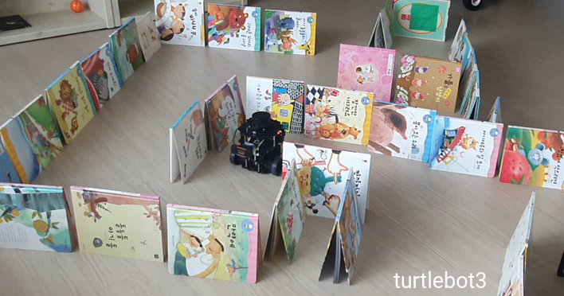
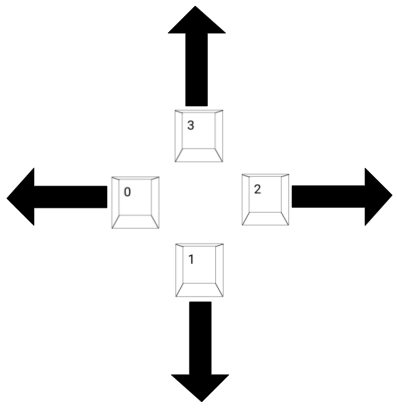

# Maze Action 
Maze Action 프로젝트는 maze_action_server/client 노드를 실행하여 로봇이 미로를 탈출하는 패키지 입니다  

- ros2의 action을 이용해서 goal, feedback, result로 수행  
- maze_action_client 노드에서 로봇에 방향 설정 명령을 Goal로 maze_action_server로 보냄  
- maze_action_server 에서는 로봇을 움직일 수 있게 토픽을 발행하며 중간 중간 feedback을 함   
- 최적으로 result로 응답을 해서 로봇의 탈출 여부를 알 수 있게 됩니다.   

로봇은 turtlebot3 burger를 사용해서 실제 미로와 비슷하게 환경을 만들어서 수행

  
[책으로 만든 미로와 turtlebot3]

<br/>

## 환경


<br/>

## 필요한 패키지
-   
turtlebot3    
[로보티즈 turtlebot3 설치는 e-Manual 링크를 참고 하세요](https://emanual.robotis.com/docs/en/platform/turtlebot3/quick-start/)

-    
시뮬레이션 대체 가능 (업데이트 예정)

-   
없다면 설치 합니다  

```
sudo apt-get update
sudo apt-get install python3-opencv
```
<br/>

## maze_action 의 패키지 설명
1. maze  
maze_action_server, maze_action_client로 ROS2 action으로 로봇 구동

2. maze_interfaces   
사용자 정의 ROS2 action type 지정

3. ros2_camera 노드 패키지  
웹캠을 통해서 image를 ROS2의 msg로 변환해서 publishing

<br/>

## 설치 방법
1. 자신의 Workspace 의 src 디렉토리로 이동
```
cd ~/colcon_ws/src
```

2. 깃 클론을 합니다
```
git clone https://github.com/terrificmn/maze_action.git
```

3. 먼저 maze_interfaces 패키지를 먼저 빌드 (maze 패키지의 의존성 때문에)
```
cd ~/colcon_ws
colcon build --packages-select maze_interfaces
```

4. 빌드가 완료되면 나머지 maze 빌드
```
colcon build --symlink-install 
```
<br/>

## 터틀봇3 실행
ssh로 터틀봇3의 private network로 접속
```
ssh ubuntu@192.168.0.101
```

```
cd ~/turtlebot3_ws
. install/setup.sh
```

turtlebot3_bringup 패키지의 런치파일 실행
```
ros2 launch turtlebot3_bringup robot.launch.py
```

다른 터미널 창을 이용해서 ssh로 다시 한번 접속을 한 후에   
카메라 패키지를 실행  (노드명 바꾸기 from ros2_camera...)
```
ssh ubuntu@192.168.0.101
cd ~/turtlebot3_ws
. install/setup.sh
ros2 launch 카메라패키지 execute 
```

이제 터틀봇3 버거는 준비 완료

<br/>

## maze_action 패키지 실행
실제 터틀봇3을 구동하거나 가제보 실행으로 시뮬레이션을 하는 2가지 방법이 있습니다.  

1. turtlebot3 구동과 함께 버전으로 실행 시키려면 maze_action_server_node를 실행합니다.  
마찬가지로 소싱을 함
```
cd ~/colcon_ws
source install/setup.sh
```

그리고 maze_action_server 노드 실행
```
ros2 run maze maze_action_server_node
```

2. 터틀봇3 없이 시뮬레이션으로 gazebo에서 실행할려고 할 때에는 런치파일로 실행합니다.
가제보 소스 해주기
```
. /usr/share/gazebo/setup.sh
```

런치파일 실행
```
ros2 launch maze maze_server.launch.py
```
*가제보 관련 업데이트 (모델확인 후)

3. 액션 클라이언트 노드 실행 (공통)  
그리고 다른 터미널을 열어줍니다. 또 sourcing을 해준다
```
source install/setup.sh
```

이번에는 maze_action_client 노드 실행함
```
ros2 run maze maze_action_client_node
```

<br/>

## action_server_node 실행 후 topic
- turtlebot3 전용으로 실행했을 경우
```
/cmd_vel
/odom
/parameter_events
/rosout
/scan
```

- gazebo 실행 했을 경우
```
/dolly/cmd_vel
/dolly/laser_scan
/dolly/odom
/parameter_events
/rosout
```

<br/>

## 가제보 실행했을 경우 카메라 화면 보기
rqt_image_view 노드 실행으로 보기
```
ros2 run rqt_image_view rqt_image_view 
```

<br/>

## maze_action_client 에서 명령 시퀸스 입력하기
로봇을 미로에서 빠져나올 수 있게 녹색 박스 출구를 향해서 방향을 입력합니다.

  
[방향 및 숫자 안내]

1. 로봇이 녹색 박스까지 잘 도달할 수 있도록 갈 방향을 입력해준다. (위 사진을 참고)  
(Action Client 에서 입력한 값을 Action Server로 goal 요청합니다)

2. 최종적으로 q 키를 눌러서 입력을 마치게 되면 로봇이 움직이기 시작한다  
(Action Server에서 cmd_vel로 퍼블리싱을 합니다.)

3. 로봇은 입력된 방향으로 회전을 한 후에 벽이 가까워질 때까지 직진을 합니다.  
(로봇의 odometry 와 laser scan을 이용합니다.)

4. 마지막으로 녹색 박스까지 잘 도달하였다면 성공 메세지 전달  
(Image subscription을 통해서 녹색 확인)

<br/>

## reference
- youtube SEOUL G-캠프 채널의 Roadbalance.com 김수영 대표님의 강좌
